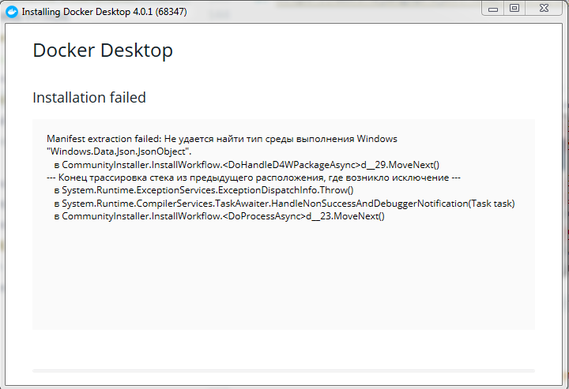

# Тестовое задание в Алабугу. Преподаватель Web-разработки Python

## Описание тестового задания (оригинальное)

Приложение для учёта товаров на складе

### Модели

Модель хранящегося товара содержит:

- название товара
- количество товара: неотрицательное целое число
- единица измерения: выбор из следующего - штук, килограмм, литров
- цена: неотрицательное целое число
- дата последней поставки или отгрузки: поле даты с сохранением последнего изменения

### REST API приложение, содержащее в себе 2 эндпоинта

- resources/ - реализует CRUD-операции с товарами на складе. При выводе списка
также должно показываться общее число различных товаров на складе.
- total-cost/ - путь возвращает общую стоимость запасов на складе выдаче ответа
сервера (в виде списка или одного объекта) у объекта также показываться суммарная
стоимость данного товара (количество * цена)

стек: Python 3, Django

## Общий подход / оценка задачи

С одной стороны, задача вдохновляюще проста и понятна - это здорово, в том плане
что задача является выполнимой в рамках тестового задания / ограничения времени.

С другой, становится понятно выполнение задания в текущем виде - даже не тянет
на MVP (Minimal Valuable Product). Остаются вопросы в плане:

1. Frontend. REST API без GUI-клиентов не имеет ценности для конечного
пользователя (оператора склада). Да, технически, это отдельная сфера - этим может
заниматься отдельный человек, но полезно знать что можно ожидать от него и как
с ним взаимодействовать. Также всегда полезно, уметь писать быстрые заглушки,
если по какой-либо причине разработка Front-end части затягивается, или
организация вообще не обладает подобным ресурсом.

2. Deploy (Развертывание). Django-приложение начинает приносить пользу только
после успешного запуска на стороне заказчика. Также этот процесс очень важен,
поскольку серверная среда заказчика, и developer-окружение программиста сильно
различаются: нужно правильно настроить настройки безопасности (сильные пароли,
HTTPS, и т.п.), нужно развести статический контент, который может раздаваться/
популярными Web-сервером (Apache, Nginx), и настроить Web-сервер на работу с
Django-приложением для динамического контента. Создание Docker-образа и/или
дополнительных shell-скриптов могут ускорить этот процесс.

3. Maintenance (Поддержка и сопровождение, обновление). Данный пункт трудно
продемонстрировать как в тестовом, так и не просто преподать/провести в
лаборатории. Поэтому, только отметим ключевые моменты.

Стоит позаботится о:

- Мониторинге системы. Отлова сбоев, а также сбор неожиданных ошибок.
- Регулярном резервном копировании данных.
- Быстрому пере-развертыванию системы, восстановлении данных из резервных копий.
- Миграции базы данных при обновлении/исправлении ошибок.

Ещё одним, не маловажным моментом является понимание того, как функционал данного
сервиса будет развиваться. В зависимости от ситуации и потребностей предприятия
могут быть реализованы следующие сценарии:

1. Разграничение прав доступа между операторами, а также журналирование их
действий (Authentication, Authorization, Accounting).
2. Журналирование приходов и отгрузок
3. Операция сверки значений Базы Данных со складом
4. Введение внутренних операций предприятия. Например, когда из коробки,
устройства, паспорта устройства собирают готовый продукт для отгрузки.
Очень важно знать, как много готовой продукции можно отгрузить, и предупреждать
заранее недостаток на складе, особенно когда приходят заказы большого объема и
необходимо определить адекватные сроки поставки товаров.
5. Масштабирование системы - в рамках одного предприятия может быть несколько
складов, они могут находиться далеко географически друг от друга. Между ними
может быть сообщение, и оно поддерживается на разных серверах.

## План

### 1. Backend: Python / Django / REST (Дедлайн - Вторник 14.09)

1. https://www.djangoproject.com/start/ - внизу Intro to Django, хорошо позволит
пройти по самым важным моментам и особенностям Django как MVC-приложения.
2. Со взгляда новичка быстро пробежимся по основам:
   1. https://docs.djangoproject.com/en/3.2/intro/install/ - Установка
   2. https://docs.djangoproject.com/en/3.2/intro/tutorial01/ - "Hello, world!" приложение
   3. https://docs.djangoproject.com/en/3.2/ - документация сориентирует по
   остальным вопросам, по мере необходимости
3. https://www.django-rest-framework.org/ - В конце, спроектируем REST-API и
задание на минимальном уровне.

#### 1.1. Заметки по ходу выполнения

1. [Заметки по Django Tutorial (Hello, world)](./tutorial-log.md). Код располагается в ветке `django-tutorial`.
2. [Если вдруг не заработала комманда `django-admin`](https://docs.djangoproject.com/en/3.2/faq/troubleshooting/#troubleshooting-django-admin)
3. [dgango-admin & manage.py](https://docs.djangoproject.com/en/3.2/ref/django-admin/)
4. [Python-package](https://docs.python.org/3/tutorial/modules.html#tut-packages)
5. [Django: settings.py](https://docs.djangoproject.com/en/3.2/topics/settings/)
6. [URL dispatcher: urls.py](https://docs.djangoproject.com/en/3.2/topics/settings/)
   1. Устройство аргументов `path()`: `route` - URL-путь, `view` которое должно вызываться по этому пути, `kwargs` - дополнительные аргументы для View, `name=` - название пути, облегчает изменение ссылок в приложении.
7. [Related objects reference](https://docs.djangoproject.com/en/3.2/ref/models/relations/)
8. [Database API reference](https://docs.djangoproject.com/en/3.2/topics/db/queries/)
9. [Руководство по Шаблонам](https://docs.djangoproject.com/en/3.2/topics/templates/)
10. Полезно знать про [`F()` - для избегания гонок](https://docs.djangoproject.com/en/3.2/ref/models/expressions/#f-expressions)

**REST_FRAMEWORK**

1. Стандартное решение полностью подходит для реализации `resources/`:
   1. [`ModelViewSet`](https://www.django-rest-framework.org/api-guide/viewsets/#modelviewset) описывает стандартные действия по работе с БД методами `.list()`, `.retrieve()`, `.create()`, 
   `.update()`, `.partial_update()`, и `.destroy()`.
   2. [`SimpleRouter`](https://www.django-rest-framework.org/api-guide/routers/#simplerouter)
   создает CRUD URL-схему, сопоставляя ихз с методами `ModelViewSet`
   3. Проверить CRUD API можно с помощью `curl`. Смотри скрипты в [`manual-tests/`](manual-tests/)
2. Для `total-cost/` напишем простую функцию, обернутую в [api_view() декоратор](https://www.django-rest-framework.org/api-guide/views/#function-based-views)

### 2. Frontend: ReactJS + Ant (Дедлайн - Среда 15.09)

Поскольку в плане дизайна нет определенных требований, постараемся просто сделать
комфортный прототип и использовать какую-нибудь готовую библиотеку компонентов.
По совету друзей - попробуем взять Ant. Судя по галерее необходимые карточки
и таблицы для нашей задачи там есть.

1. https://reactjs.org/
2. https://reactrouter.com/
3. https://ant.design/

#### 2.1. Заметки по ходу выполнения

1. За основу, возьмем опыт с предыдущего [тестового задания](https://github.com/Suhoy95/nutnet-weather), [https://nutnet.gramend.ru/](https://nutnet.gramend.ru/).
Только в данном случае не требуется тщательная работа с версткой/адаптивным дизайном.
2. Журнал: [frontend-log.md](frontend-log.md)
3. Во время отладки, если Frontend & Django находятся на разных серверах, 
удобно прописать CORS в дополнении к [Firefox](https://addons.mozilla.org/en-US/firefox/addon/cross-domain-cors/)

### 3. Deploy / Docker (Дедлайн - Четверг 16.09 15:00)

В конце, остается развернуть получившееся приложение. Сделаем сочетание
Django+uWSGI+Nginx. А также создадим Docker-образ для развертывания на сервере

1. https://docs.docker.com/samples/django/
2. https://docs.djangoproject.com/en/3.2/howto/deployment/wsgi/uwsgi/
3. https://docs.djangoproject.com/en/3.2/howto/deployment/checklist/

#### 3.1. Заметки по ходу выполнения

1. Появилась асинхронная версия коннектора - ASGI. Интересно попробовать, 
изучить, как сильно меняется производительность и сложность написания кода.
   1. [WSGI docs](https://wsgi.readthedocs.io/en/latest/index.html) & [Django docs: How to deploy with WSGI](https://docs.djangoproject.com/en/3.2/howto/deployment/wsgi/)
   2. [ASGI docs](https://asgi.readthedocs.io/en/latest/) & [Django docs: How to deploy with ASGI](https://docs.djangoproject.com/en/3.2/howto/deployment/asgi/)
2. Для начала оформим проект, чтобы его было удобно собрать и запустить из 
[GitHub](https://github.com/elsewhencode/project-guidelines/blob/master/README.sample.md), чтобы другие программисты могли присоединится к работе.
3. В данный момент `Docker` не захотел устанавливаться на компьютер:

4. Чтобы развернуть рабочий вариант на классическом VDS, понадобилось срочно 
добавить к API [Аутентификацию](https://www.django-rest-framework.org/api-guide/authentication/) и [Авторизацию](https://www.django-rest-framework.org/api-guide/permissions/).
5. Времени осталось мало, но все же попробуем развернуть наше Django-приложение на VSD

### 4. Maintenance / Вспомогательные инструменты

- [Лучшие практики по ведению проекта](https://github.com/elsewhencode/project-guidelines)
- Система контроля версий - git
  - [Git book](https://git-scm.com/book/ru/v2)
  - [Git How To](https://githowto.com/ru)
- Использование командной среды разработки, на примере:
  - [GitHub Issues](https://guides.github.com/features/issues/)
  - [GitHub Actions](https://docs.github.com/en/actions)
  - [Github Project Boards](https://docs.github.com/en/issues/organizing-your-work-with-project-boards/managing-project-boards/about-project-boards)
- Статические анализаторы кода:
  - [pylint](https://www.pylint.org)
  - [eslint](https://eslint.org/)
- Unit-тестирование
