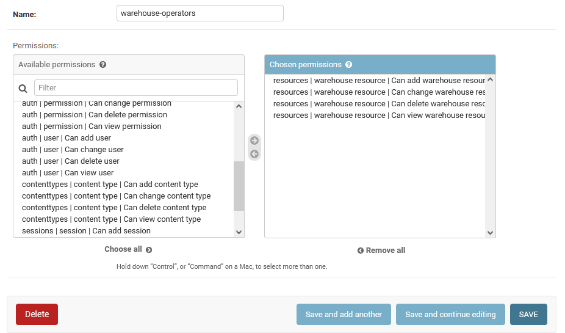
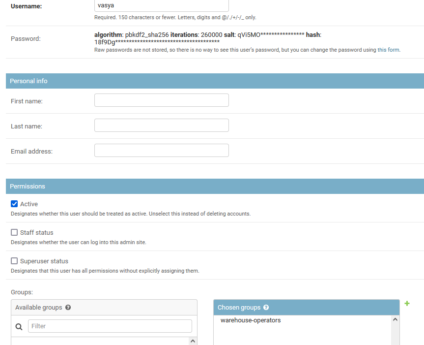

# Склад РиК

Python/Django приложение для работы со складом. Данный проект является
тестовым заданием. Подробности по заданию, ходу его выполнения и заметки можно
посмотреть в [Документации](./Documentation/README.md).

## Установка / Быстрый старт (Install / Getting started)

Для работы над проектом требуется наличие [Python 3](https://www.python.org/downloads/), [Node.js & npm](https://nodejs.org/en/).
Дополнительно, желательно наличие Bash-окружения (Например, [Git-bash для Windows](https://gitforwindows.org/)), и утилиты [`curl`](https://curl.se/windows/). для тестирования REST API.

```sh
python --version
> Python 3.7.0
node --version
> v12.14.1
npm --version
> 6.13.4
```

Установить все зависимости, и собрать React-Frontend можно с помощью скрипта (Также полезно его изучить, для понимания структуры проекта):

```bash
./build.sh
```

Создаем супер-пользователя и заполняем Базу данных тестовыми данными (если необходимо):

```bash
.\venv\Scripts\activate # или source ./venv/bin/activate
cd warehouse
python manage.py createsuperuser

# Заполнить БД тестовыми товарами
python fillTestData.py
```

Последним шагом, можно запустить тестовый сервер:
```
.\venv\Scripts\activate # или source ./venv/bin/activate
cd warehouse
python manage.py runserver
```

В целях безопасной работы, рекомендуется зайти администратором. Сделать группу
с разрешениями на изменение только товаров:



И создать обычного пользователя для работы со складом:



Тестирование:

- http://127.0.0.1:8000/fe/index.html#/ - React+Ant фронденд (С перенаправлением на Django REST login API)
- http://127.0.0.1:8000/resources/ - работа с REST API товаров
- http://127.0.0.1:8000/total-cost/ - API для получения итоговой сметы по товарам на складе.
- http://127.0.0.1:8000/admin/login/ - Django-админка
- [./manual-tests/](./manual-tests/) - примеры curl-запросов для тестирования API. Для их тестирования стоит **ВРЕМЕННО** выключить Авторизацию в [`./warehouse/resources/views.py`](./warehouse/resources/views.py), вернув строчки с `permissions.AllowAny`.
